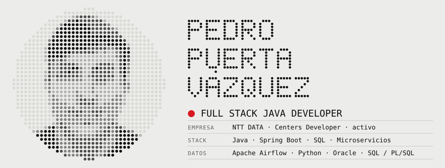
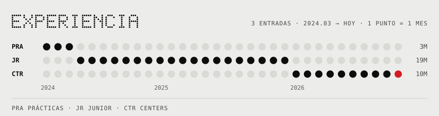
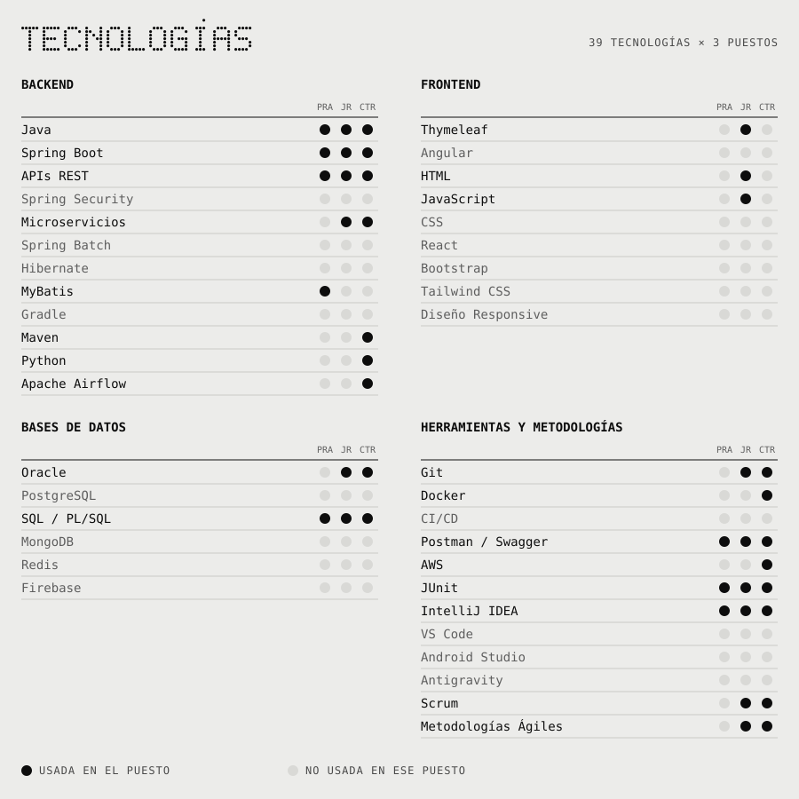

<b>ES</b> · <a href="README.md">EN</a>

<picture>
  <source media="(prefers-color-scheme: dark)" srcset="assets/header-es-dark.svg">
  
</picture>

Desarrollador full stack en NTT DATA. Construyo microservicios con Java y Spring Boot, procesos de datos con Apache Airflow y Python, y las interfaces que los usan.

> Ahora: experimentando con IA y LLMs en el desarrollo, desde SDD hasta vibe coding.

<picture>
  <source media="(prefers-color-scheme: dark)" srcset="assets/log-es-dark.svg">
  
</picture>

<picture>
  <source media="(prefers-color-scheme: dark)" srcset="assets/stack-es-dark.svg">
  
</picture>

## Contacto

- `$` open [linkedin.com/in/pedropuertavazquez](https://www.linkedin.com/in/pedropuertavazquez)
- `$` open [github.com/pedro12pv](https://github.com/pedro12pv)
