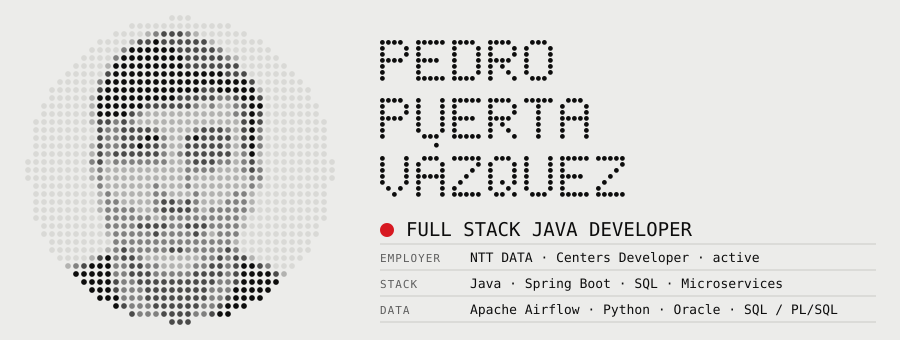
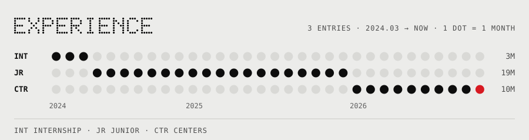
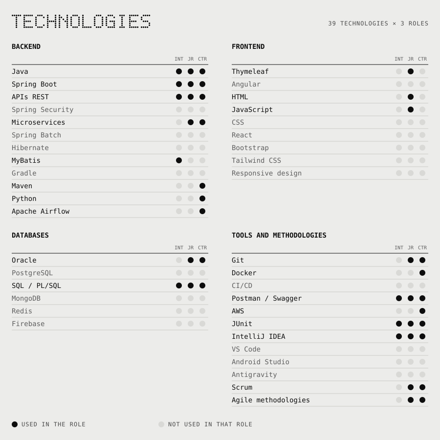

<b>EN</b> · <a href="README.es.md">ES</a>

<picture>
  <source media="(prefers-color-scheme: dark)" srcset="assets/header-en-dark.svg">
  
</picture>

Full stack developer at NTT DATA. I build microservices with Java and Spring Boot, data processes with Apache Airflow and Python, and the interfaces that use them.

> Right now: experimenting with AI and LLMs in development, from SDD to vibe coding.

<picture>
  <source media="(prefers-color-scheme: dark)" srcset="assets/log-en-dark.svg">
  
</picture>

<picture>
  <source media="(prefers-color-scheme: dark)" srcset="assets/stack-en-dark.svg">
  
</picture>

## Contact

- `$` open [linkedin.com/in/pedropuertavazquez](https://www.linkedin.com/in/pedropuertavazquez)
- `$` open [github.com/pedro12pv](https://github.com/pedro12pv)
